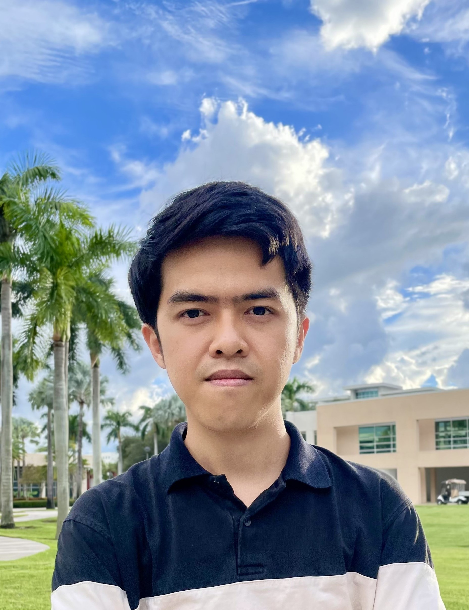

 

:::{.grid .gap-4 .align-items-center}

::: {.g-col-12 .g-col-md-4 .text-center .order-1 .order-md-2}

<!-- Taken at ... -->
:::

::: {.g-col-12 .g-col-md-8 .order-2 .order-md-1}
My name is Nam Hoai Le (Lê Hoài Nam in Vietnamese). I am currently a Ph.D. student in the [Department of Mathematics and Statistics](https://www.math.fau.edu/){target="_blank"} at [Florida Atlantic University](https://www.fau.edu/){target="_blank"}, where I am supervised by Prof. [Francesco Sica](https://www.math.fau.edu/people/faculty/sica_francesco.php){.people-link target="_blank"}. Before beginning my Ph.D, I had the privilege of working with Prof. [Ha Tran](https://sites.google.com/site/hatrannguyenthanh/home){.people-link target="_blank"} during my master’s studies at Ho Chi Minh City University of Science. Earlier, I was even more fortunate to be supervised by Prof. [My Vinh Quang](https://www.genealogy.math.ndsu.nodak.edu/id.php?id=20792){.people-link target="_blank"} during my bachelor’s degree.

My research interests lie in computational number theory and its applications in cryptography and coding theory. In addition, I am deeply interested in quantum computing and am currently exploring several problems in this area.

  

  

  

  

  

:::

:::

###  Latest Updates

::: {.news-table}
| Date       | News |
|-----|---------------|
| October 12, 2025       | Attended *Applied Algebra Days Workshop* at Florida Atlantic University. |
| September 22, 2025       | Attended *Preliminary Arizona Winter School 2025*. |
| September 2, 2025       | Passed the *Analysis Qualifying Exam*. |
| August 18–29, 2025     | Participated in the *Graduate Workshop on Linear Algebra over Finite Fields & Applications* at Brown University. |
| June 16–27, 2025       | Participated in the *Rethinking Number Theory 6 (RNT 6) Workshop* online. |
:::
 

[See all updates](news.qmd){.btn .btn-outline-danger target="_blank" style="margin-bottom: 0.5em; border-radius: 12px;"}

### Contact 
If you would like to discuss a potential collaboration, please feel free to email me.  

::: {.callout-note appearance="simple"}
### 📧 **Email**:  
namhoai12to2 [at] gmail [dot] com  
namle2024 [at] fau [dot] edu
:::

::: {.callout-note appearance="simple"}
### 📍 **Address**:   
Department of Mathematics and Statistics   
Florida Atlantic University  
777 Glades Rd, Boca Raton, FL 33431, USA
:::

<!-- namle2024 [at] fau [dot] edu -->

<!-- 

</a>

   -->